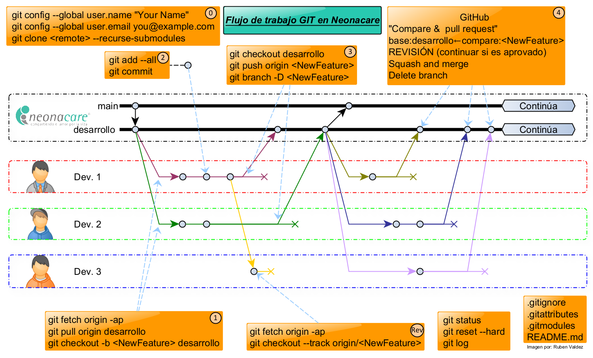

# Neonacare guía GIT/GitHub


**Este repositorio es una guía para la correcta implementación de GIT y GitHub en las actividades de diseño y desarrollo de la empresa, pudiendo escalar a otros procesos o áreas.**

## PCBs contenidos
1. [PCB Sensores](./ICG_Sensores/).
2. [PCB Adquición](./ICG_Adq_v3/).
3. [PCB Potencia](./ICG_Potencia_v3/).
4. [PCB Báscula](./ICG_Bascula_v3/).
5. [PCB Conectores](./ICG_Conectores_v1/).
6. [PCB Distribución AC](./ICG_AC_Distribucion_v1/).
7. [Monitor de humidificador](./ICG_HR_Monitor_v1/).
8. [Monitor Calefactor](./ICG_Heater_Monitor_v1/).

## ¿Cómo trabajar con repositorios en Neonacare?
### Prerequisitos
1. Tener cuenta de GitHub.
2. Instalar Git. [link de descarga](https://git-scm.com/downloads).
3. Contar con Altium Designer (**Versión > 17.1**).
4. Estar como colaborador en este repositorio.

### Flujo de Trabajo


Git es un sistema de control de versiones y es ampliamente utilizado para el control de versiones de archivos (principalmente software). De las características de Git que mayor interés nos generan son las siguientes:

+ Trabajo colaborativo de varias personas en un mismo proyecto.
+ Trazabilidad a los cambios realizados.
+ Servicio de Host en la nube por medio de otros servicios, por ejemplo, GitHub.

El método de trabajo sugerido es el model Git-Flow. Este método se basa en el método propuesto por Vincent Driessen en [**A succesful Git branching model**](https://nvie.com/posts/a-successful-git-branching-model/), se utilizarán **dos ramas principales** (main/master y desarrollo), y **múltiples ramas** con un nombre que haga alusión a la mejora o actualización a desarrollar.

### A cerca de las ramas en Github

Para entender el uso de las ramas se debe comprender el concepto de `commit`.

Cuando se realiza un [commit](https://git-scm.com/book/es/v2/Fundamentos-de-Git-Guardando-cambios-en-el-Repositorio#:~:text=Confirmar%20tus%20Cambios,confirmar%20tus%20cambios) en Git, se realiza un "guardado" de todos los archivos del repositorio que se encuentran hasta ese momento. Al realizar commits mientras se progresa en el reposotorio, se va registrando un historial de los cambios que el repositorio ha sufrido a lo largo del tiempo.

La herramienta de Git, así como GitHub (servicio para repositorios remotos o online) permiten trabajar con base en [ramificaciones](https://git-scm.com/book/es/v2/Ramificaciones-en-Git-%C2%BFQu%C3%A9-es-una-rama%3F#:~:text=Una%20rama%20Git%20es%20simplemente,master%20apuntando%20a%20dicha%20confirmaci%C3%B3n.). Cuando se realiza una ramificación, se toma como base el commit de una rama base y de ahí, se pueden continuar realizando commits sin afectar a  la rama origen. Una vez realizados los cambios los cambios pueden ser incorporados nuevamente a la rama origen.

El método de ramificación para el los repositorios de Neonacare se muestran en la siguiente imagen:



0. Se configura por primera y única vez [tu identidad](https://git-scm.com/book/es/v2/Inicio---Sobre-el-Control-de-Versiones-Configurando-Git-por-primera-vez#:~:text=Tu%20Identidad,usan%20esta%20informaci%C3%B3n).
1. Se verifican [actualizaciones](https://git-scm.com/book/es/v2/Ramificaciones-en-Git-Ramas-Remotas#:~:text=Para%20sincronizarte%2C%20puedes,posici%C3%B3n%20m%C3%A1s%20reciente.) de la rama `desarrollo` y se crea [una nueva rama](https://git-scm.com/book/es/v2/Ramificaciones-en-Git-Procedimientos-B%c3%a1sicos-para-Ramificar-y-Fusionar#:~:text=Para%20crear%20una%20nueva%20rama%20y%20saltar%20a%20ella%2C%20en%20un%20solo%20paso%2C%20puedes%20utilizar%20el%20comando%20git%20checkout%20con%20la%20opci%C3%B3n%20%2Db) desde ahí.
2. Se realizan los [`commits`](https://git-scm.com/book/es/v2/Fundamentos-de-Git-Guardando-cambios-en-el-Repositorio#:~:text=Ahora%20que%20tu%20%C3%A1rea%20de%20preparaci%C3%B3n%20est%C3%A1%20como%20quieres%2C%20puedes%20confirmar%20tus%20cambios) necesarios para el desarrollo de la nueva caracteristica.
3. Se [envían](https://git-scm.com/book/es/v2/Ramificaciones-en-Git-Ramas-Remotas#:~:text=Publicar,a%20los%20dem%C3%A1s) los cambios propuestos al repositorio remoto para su [revisión](https://git-scm.com/book/es/v2/Ramificaciones-en-Git-Ramas-Remotas#:~:text=Hacer%20Seguimiento%20a,par%C3%A1metro%20%2D%2Dtrack) y aprobación.

4. Se aprueban los cambios y se incorporan a la rama `desarrollo`. 

En este método de ramificación se observan las siguientes características:

+ El repositorio trabaja con dos ramas principales `main/master` y `desarrollo` y **son controladas por la empresa**, no se usan para trabajar sobre ellas, sólo están destinadas a la aprobación e incorporación de nuevos cambios de otras ramificaciones.
+ En la rama `main` se colocarán versiones estables del repositorio (versiones aprobadas para su uso en producción o comercialmente) provenientes **siempre** de la rama `desarrollo`.
+ En la rama `desarrollo` y mediante el apoyo de nuevas ramas, se lleva a cabo el trabajo en proceso para crear la versión de producción (estable) inicial  y el trabajo subsecuente para siguientes versiones estables.
+ El desarrollo de nuevas características se inicia realizando una ramificación **desde** la rama de `desarrollo`.
+ En la nueva rama creada para la implementación de nuevas caracteristicas, se realizan las modificaciones necesarias al repositorio pudiento utilizarse todos los commits que se requieran.
+ Al finalizar la implementación de nuevas características, se revisan, y si son satisfactorias y aprobadas, se integran a la rama de `desarrollo`.
+ Una vez generadas suficientes mejoras en la rama de `desarrollo` y considerando que la rama de `desarrollo` en ese punto o momento es ***estable***, se une la rama `desarrollo` a la rama `main` para generar una nueva versión estable.

## Metodología del flujo de trabajo
### 1) Abrir línea de comando de Git (Git Bash)

1. Abrir explarador de windows.
2. Dar click derecho y  seleccionar `Git Bash Here`.


### 2) Guardar usuario y contraseña de GitHub (una vez)
1. [Abrir Git Bash](#abrir-línea-de-comando-de-git-git-bash).
2. Escribir los siguientes [comandos](https://git-scm.com/book/es/v2/Inicio---Sobre-el-Control-de-Versiones-Configurando-Git-por-primera-vez#:~:text=Tu%20Identidad,commits%20que%20env%C3%ADas).
``` console
git config --global user.name "your username"
git config --global user.password "your password"
```

### 3) Clonar el repositorio (una vez)
1. [Abrir Git Bash](#abrir-línea-de-comando-de-git-git-bash) en la carpeta donde se desea clonar el repositorio.
2. Ingresar el siguiente comando `git clone <url_del repositorio> --recurse-submodules`.

### 4) Actualizar repositorio local
Para obtener los últimos cambios al repositorio local, realizamos los siguientes pasos:
1. [Abrir Git Bash](#abrir-línea-de-comando-de-git-git-bash) en la carpeta del repositorio.
2. Ingresar los siguientes comandos para actualizar una rama local en particular
``` console
git fetch origin -p
git pull origin rama-a-actualizar
```
Este comando actualizara el repositorio local con los cambios que exitan en el repositorio remoto (en GitHub).

### 5) Crear rama de características
Las ramas de características nuevas o de tópicos  tienen las siguientes características:
1. Se generan a partir de la rama de `desarrollo`.
2. Deben volver a unirse a la rama de `desarrollo`.

Las ramas de características nuevas son usadas para generar actualizaciones o mejoras al desarrollo del proyecto. Esta rama existe por el tiempo que dure el desarrollo de la característica a implementar. Una vez terminada la actualización o mejora, se revisan los cambios y si son satisfactorios y aprobados, significa que esta rama se incorporará a la rama de desarrollo mediante un `pull-request`.

Para empezar una nueva rama se coloca el siguiente comando
``` console
git checkout -b <NewFeature> desarrollo
```
Donde `<NewFeature>` es el nombre de la característica a trabajar. (De preferencia el nombre no debe tener espacios)

### 6) Realizar commits
Cuando se cuente con un avance de la característica y se desee guardar el trabajo realizado hasta ese punto, se deberá realizar un `commit` de los cambios realizados hasta ese momento. Para ello se ingresan los siguientes comandos :
``` console
# "Agrega todos los cambios generados al stage, se presentan 3 opciones"
git add .
git add --all
git add <archivo_a_agregar.opc>

# "Este comando abre la pantalla para mensaje de commit"
git commit
```
El mensaje de commit debe de indicar de manera breve los cambios que se están realizando.


Dependiendo del editor de textos, por default "nano" (para asignarlo por default ejecute el siguiente comando `git config --global core.editor "nano -w"`), una vez que se abre la ventana de commit se realiza lo siguiente:
1. Se ingresa un título breve del commit (se recomienda hasta 50 caracteres).
2. Se ingresa el resto del mensaje del commit (de ser necesario).
3. Se presiona <kbd>Ctrl+O</kbd> (tecla Ctrl junto con la letra O) y enseguida la tecla <kbd>Enter</kbd> para guardar todo el mensaje.
4. Se presiona <kbd>Ctrl+X</kbd> (tecla Ctrl junto con la letra X) para salir del editor.

Con esto hemos realizado un `commit`, se pueden seguir realizando los cambios necesarios para terminar la caracteristica nueva y durante el proceso seguir realizando `commit` a consideración del usuario. Una vez concluida la nueva caracteristica o mejora y realizando el último `commit`, se procede a enviar la nueva rama al repositorio remoto.

### 7) Subir rama de características a repositorio remoto
Para enviar una nueva rama al repositorio remoto se realizan las siguientes acciones:

1. Cambiar a la rama de desarrollo.
```` console
git checkout desarrollo
````
2. Realizar un `push` a repositorio remoto.
``` console
git push origin <NewFeature>
```

### 8) Crear **pull-request**

Un `pull-request` es una petición a través de GitHub de unir una rama del repositorio a  otra rama en especifico.

Para crear un pull  request  se entra a  [GitHub](https://github.com/) y al inicio delrepositorio debe de aparecer  un mensaje como el de la imagen a continuación:


Posteriormente se debe de seleccionar la rama base a la cual se quiere unir A menos que se especifique otra cosa, los pull-request se realizarán de **rama-característica &rarr; desarrollo** o **desarrollo &rarr; master**


#### Revisar `pull-request`

Una vez creado el `pull-request` se le notificará al resto de colaboradores para que revisen los cambios. GitHub permite añadir comentarios al pull request donde se pueden realizar discuciones, aclaraciones, solicitud de cambios al pull-request. 

#### Aceptar `pull-request`
El aceptar el pull-request es una actividad que le correspone al encargado del repositorio o del proyecto. Este deberá seleccionar alguna de las opciones de unión del pull-request y confirmar la unión.


Posterior a la unión del pull-request se puede eliminar la rama como se indica en la imagen:


De manera similar se deberá eliminar la rama en el repositorio local mediante el siguiente comando:

```` console
git checkout desarrollo        
# En caso de estar en la rama ue se quiere eliminar 

git branch -D <nombre-de-mi-rama>
````

posteriormente se deberá realizar [actualizar el repositorio local](#actualizar-repositorio-local)